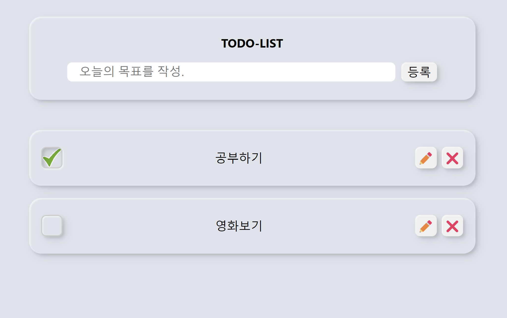

# React -TODO List

### 🤖PAGE

- Editor : Visual Studio Code
- Tech Stack : React, CSS Module, useContext, JSON Server
- 배포 : Github.io(gh-pages), Glitch
- Link : https://0huns.github.io/todo

### 📑UI / UX

css-module 방식으로 스타일을 작성하였으며, fontSize와 rem을 통해 미디어쿼리로 간단한 반응형 웹으로 구현했다. 
전체적인 스타일 컨셉은 boxShadow를 활용하여 버튼 컨셉으로 구성하였다.

### 🛠️주요 기능

💡 List 생성 / 삭제 
💡 List 완료 체크 
💡 List 수정 
💡 데이터 저장 및 통신 